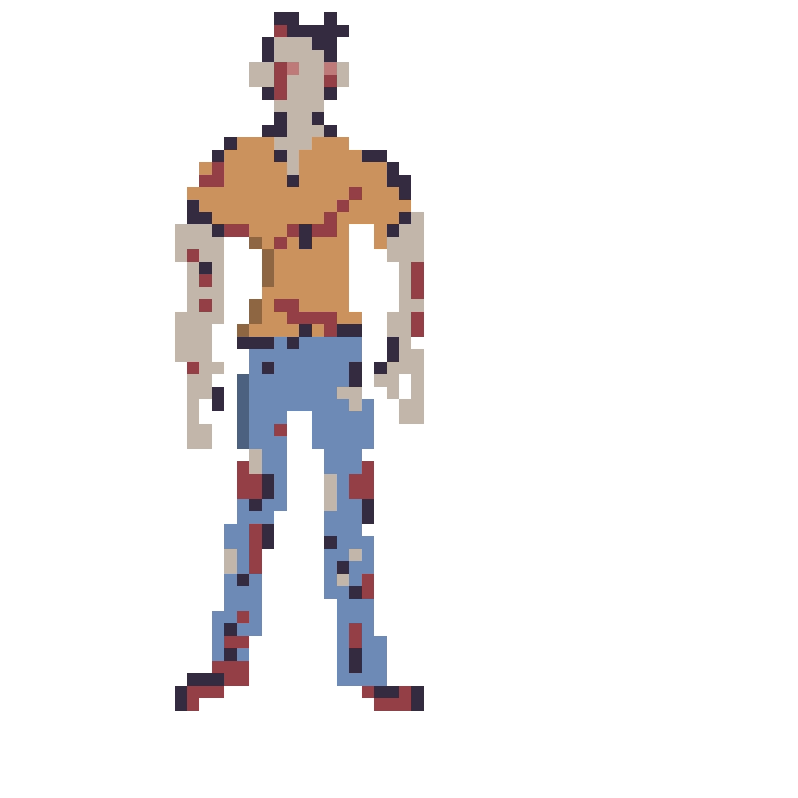
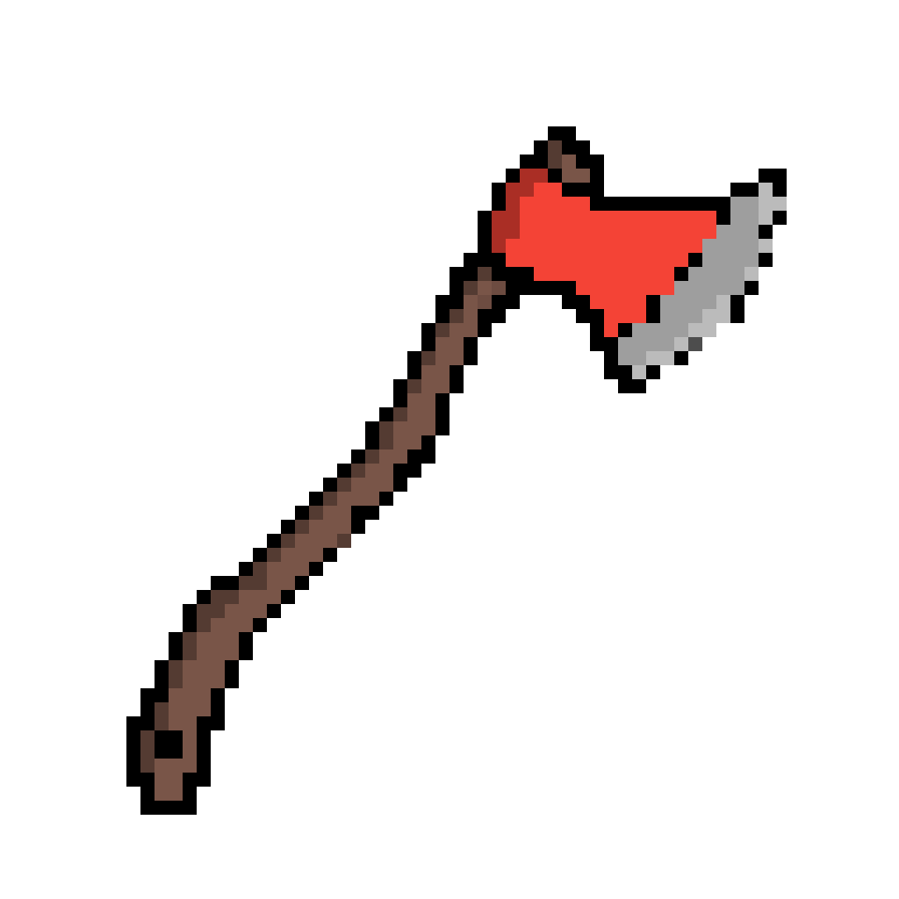
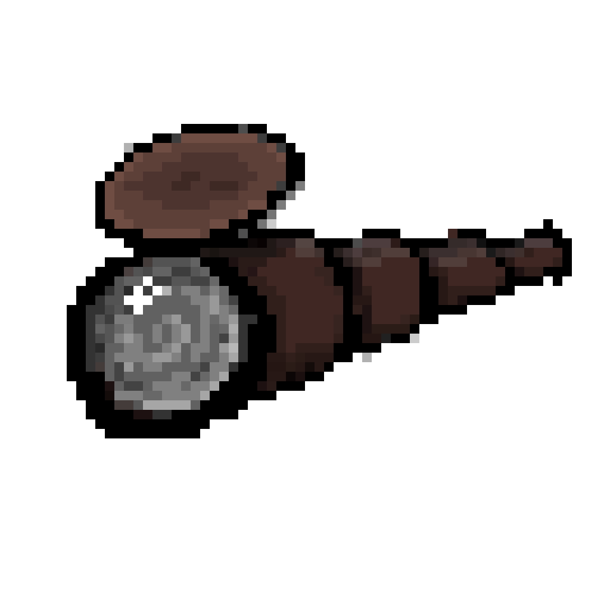
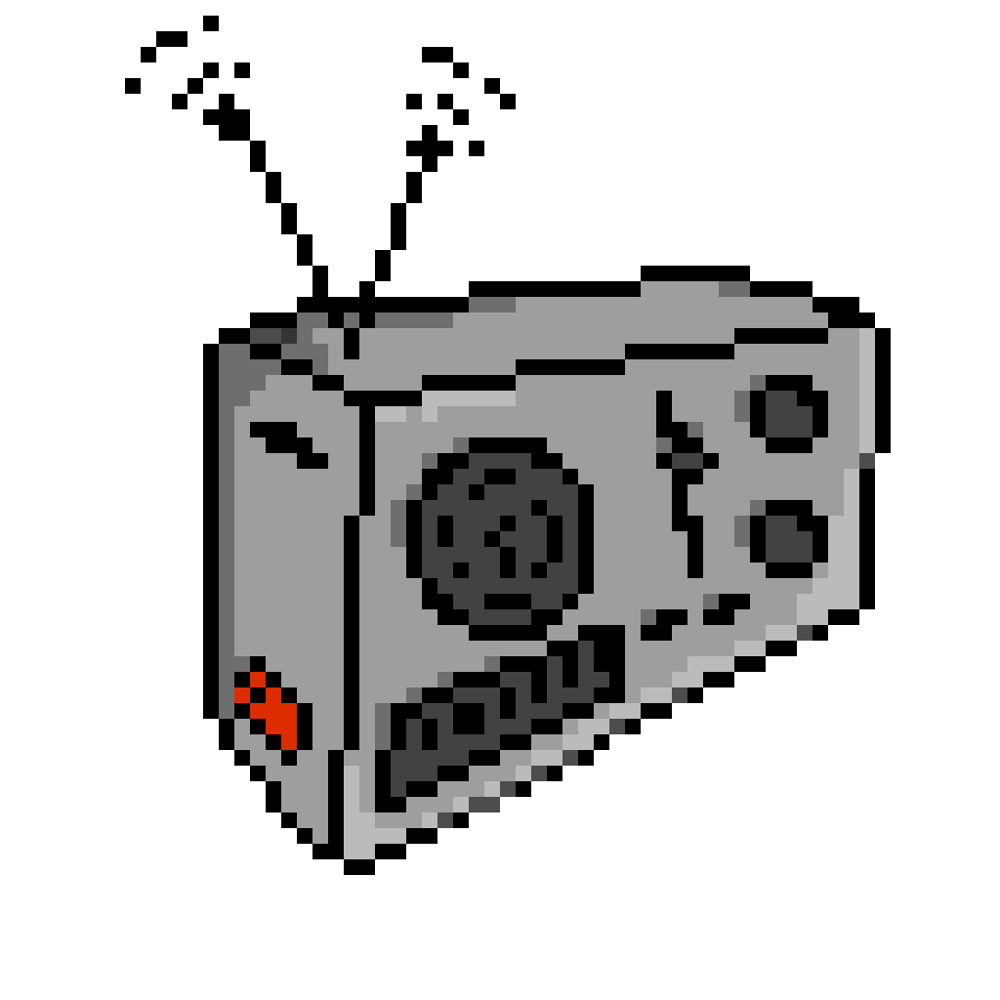
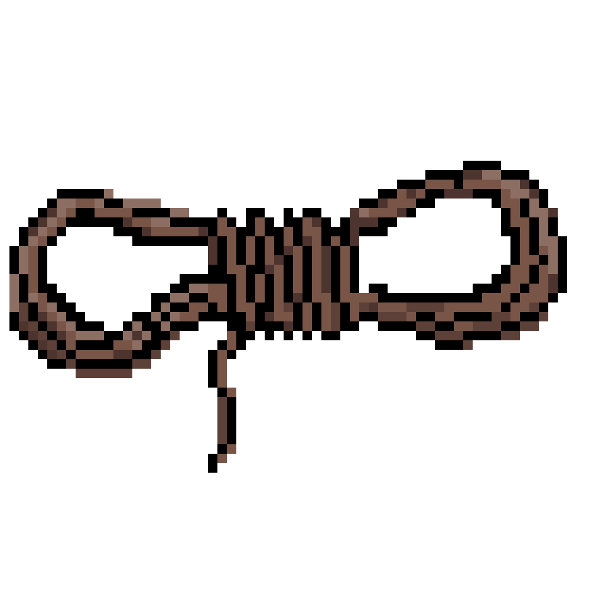

Keeping track of what I've drawn from the "Zombies Run" story, mainly [codex](https://zrx.app/codex)/supply items: 

- [x] Zombie
	Just a run-of-the-mill long dead walker you wouldn't want to be locked in with. 
	)
	
- [ ]  9mm Ammo

	A box of ammunition for a 9mm pistol. It’s about two-thirds full. These bullets will save lives.
	    

- [ ]  Antibiotics

	A packet of generic antibiotics. There are still enough left for a decent course of treatment. These things are gold-dust nowadays.

	
    
- [ ]  Anti-depressants

	Surprisingly, the apocalypse hasn’t *improved* anyone’s mental health. While these won’t work for everyone, for some they could mean the difference between life and death.

    

- [x]  Axe

	To call this a sharp bit of metal attached to a stick is to insult the brutal efficiency of the mighty axe. Unfortunately, that’s basically what it is. But awesome.

    
    

- [ ]  Bandages

	Absorbent, sterile, pliant. These fabric strips will help keep any wound clean and dry.

    

- [ ]  Baton

	Not for twirling or marching, some might say this baton was once an instrument of police brutality. Now it’s an instrument of Runner brutality. Those zombies won’t know what hit them.

    

- [ ]  Batteries

	Batteries are now one of the few sources of power. Unfortunately, there are only three left in this pack. Still, it’s a valuable find.

    

- [ ]  Beach ball

	The nearest beach is a long run away, but don’t let that put you off. Maybe if some of the armoury sandbags accidentally split open, pouring onto the Abel courtyard, the Township could enjoy its first game of volleyball.

    

- [ ]  Baseball Bat

	A solid, dependable weapon. Try to resist yelling “home run” every time you take a head off with it, though.

    

- [ ]  Bedroll

	It’s no sleeping bag, but in a pinch a bedroll adds that extra level of comfort when sleeping on the cold hard ground. Or the cold wet ground. Or any ground, really.

    

- [ ]  Board game

	One of the playing pieces is missing and some of the cards are crumpled, but this board game is definitely still playable. Ah, but the instructions are missing. Never mind, Sam and Doc Myers will figure it out. Or invent new rules. Can’t wait for another round of Demons and Darkness of Catan to Ride!

    

- [ ]  Book

	In terms of post-apocalypse entertainment, a book is often the best you can get. This should be popular back at Abel.

    

- [ ]  Boots

	A sturdy pair of thick-heeled, waterproof walking boots. Accidentally step on a crawler in these and there won’t be much left of them to scrape off.

    

- [ ]  Box of Lightbulbs

	Before the outbreak, no-one gave lightbulbs a second thought. Now, they’re valuable treasure. Fragile, poorly-boxed treasure.

    

- [ ]  Bottled Water

	A plastic bottle containing water. The seal is unbroken - it should still be good. The label’s come off, though. Why do these things have expiry dates on them?

    

- [ ]  Playing cards

	Unbelievable. A full set of playing cards. Runner 8 always said she fancied putting a poker night together. No poker chips, so you’ll have to play on a bartering system. Luckily Rajit is terrible at all games, so you could be having hot showers every day, if you, ahem, play your cards right.

    

- [ ]  Car Battery

	This’ll be difficult to charge, but being able to store large amounts of power is vitally important. A good find.

    

- [ ]  Cooking knife

	This knife would be perfect for dicing vegetables in the Abel kitchen - but it might be worth etching “Food only” into the handle, so it that it doesn’t find its way into a zombie’s skull one day.

    

- [ ]  Cooking oil

	As rare as cooked breakfasts are, without this they’d never happen at all. You didn’t happen to find any bacon with it, did you? Oh well. Maybe next time.

    

- [x]  Candles

	These will come in handy the next time the Abel generators go down overnight. A perfect opportunity to stay up and tell each other scary stories. Just make sure someone’s looking after Sam this time, so that there aren’t any more accidents...

    
	
	
- [ ]  Overcoat

	It’s waterproof, warm, and not too badly bloodstained. It’s perfect.

    

- [ ]  Cricket bat

	Sure, it’s not WG, but it’ll still remove zombie heads from zombie shoulders quicker than you can yell “out!”.

    

- [ ]  Crossbow

	Where on earth did you find this? Does it still work? As far as weapons go, crossbows are quiet, accurate and powerful. Perfect for picking off unsuspecting zoms from a distance.

    

- [ ]  Crutches

	They’re basically sticks with handles. But don’t say that to anyone who’s lost the use of a leg. This pair seem to be in pretty good repair.

    

- [ ]  Cutlery

	It’s not that anyone minds if people eat with their fingers, but surely the quicker we re-establish basic social etiquette and hygiene, the better.

    

- [ ]  Disposable camera

	Largely useless, since even if there was a dark room nearby, no-one in Abel knows how to develop photos. A lost art even before the world went to hell. Still, it makes that really satisfying clicking noise that only analogue cameras can. Not to mention the kraaaak, kraaaak of the winding mechanism. Ah, simpler times...

    

- [ ]  Dentistry equipment

	This is vital stuff. Some people might object to an anaesthetic-free tooth extraction, but it’s better than toothache. Or at least that’s what Dr Myers keeps saying.

    

- [ ]  Deodorant

	Thanks to you, Abel will soon be smelling like a high school disco, but surely that’s better than the alternative?

    

- [ ]  Dress

	It’s warm and comfortable, that’s the main thing. And the pattern conceals the bloodstain brilliantly.

    

- [ ]  DVD

	Please don’t let it be another copy of Twilight: New Moon... Please don’t let it be another copy of Twilight: New Moon…

    

- [ ]  First Aid Kit

	A small case full of useful medical supplies: bandages, antiseptic, even some medicine. It’s pretty battered, but most of the stuff inside is intact.

    

- [ ]  Football

	Abel is home to some pretty avid football fans, so they’ll be very happy to see this. Real football, that is. Where the ball actually comes in contact with a foot more often than not.

    

- [ ]  Fuel Can

	An emergency fuel canister. It’s made from dark green plastic, and is in surprisingly good shape. It’s still mostly full. This is a valuable find.

    

- [ ]  Firewood

	It used to be a Louis XIV chair, but the owner isn’t going to complain if you take an axe to it. In fact, by the sound of that cough, you may need to take an axe to the owner.

    

- [ ]  Firestarters

	Ironically named, really. Since they’re best used when thrown onto an already started fire. “Fire continuers”, perhaps? Whatever you call them, there are plenty of people around Abel who would be glad to receive a few more of these.

    

- [ ]  Garden tools

	Jack and Eugene will be happy to see these. They have their own little vegetable plot where they’re growing some “hipster veg” seeds they found on their way into Abel. Purple carrots and white tomatoes? Whatever next.

    

- [ ]  Glasses

	One of the lenses is missing, but that’s okay because the other one is a ludicrously strong prescription. Whoever used to own these, chances are they won’t have survived long without them...

    

- [ ]  Hairbrush

	The more of these you can find, the less likely it is that there will be a repeat of the Great Summer Nits Outbreak. At least they’re easier to kill than zombies.

    

- [ ]  Hearing Aid

	Greg’s going to be delighted. These things are like gold dust, and sharing his with Jessica and Mrs Tembe has been no fun at all.

    

- [ ]  Horse shoe

	Allegedly, these bring the bearer good luck. Hopefully a bit more luck than the poor horse who lost it in the first place.

    

- [ ]  Insulin

	A small glass vial containing insulin. Someone will be very glad to receive this.

    

- [ ]  Laptop

	Before the outbreak, this thing was the top of the line. Now it’s a dead battery attached to a smorgasboard of spare parts.

    

- [ ]  Lock pick

	By now, a lot of the towns near Abel have already been looted clean. These lockpicks mean you can get to the valuable stuff that’s hidden away. Such as… ugh, more money? Great.

    

- [ ]  Makeup

	It’s when things are at their worst that it’s good to look your best. And Sam will be thrilled you’ve found this – he’s been dying to organise a Rocky Horror night.

    

- [ ]  Money

	See a penny, pick it up, and all that day you’ll have… well, a penny. Not much use now, though.

    

- [ ]  Mobile Phone

	A broken mobile. Someone must have dropped it while trying to escape. It won’t work, but the parts might be useful.

    

- [ ]  Matches

	Each match is a wee beacon of hope, symbolising light and life and impending baked beans.

    

- [ ]  Air Recycling Filter

	Spare filter module for a Pandora Haze industrial air recycler. Assuming the Venus One colony’s air recyclers are working, this module will help you maintain them.

    

- [ ]  Antique Paper Book

	Paperback books are still produced late into the 21st century, as a luxury item. Captain Myers is an avid collector, and the Venus One colony boasts a small paper library. This find will boost crew morale.

    

- [ ]  Apodesmos

	A woolen garment of Minoan derivation, wrapped at the front, pinned at the back. Provides support to female Olympians.

    

- [ ]  Air Mask

	Filters the most harmful particles from the atmosphere. Wirelessly linked to health monitors.

    

- [ ]  Amelia Spens Wanted Beacon

	Once the feared CEO of Pandora Haze, Amelia Spens and her clones have been on the run since a dramatic falling out with her board. These beacons offer a hefty reward for information leading to her capture.

    

- [ ]  Intelligent Blanket

	This lightweight blanket uses thermal coils to heat and cool itself to the user’s specifications. Beyond that, it’s just a blanket, but at least it’ll give you something soft to sleep on.

    

- [ ]  Boiled Sweet

	Keep up your energy with these long-lasting sweets. Just makes sure you don't swallow it in a hurry!

    

- [ ]  Bonbons

	A small box of delightful chocolate confections, each containing the most wondrous fillings. If you aren't careful, the box will be entirely empty before long...

    

- [ ]  Brooch

	A battered oval brooch made of bronze. It has faded filigree and a strange design, with a running person escaping outstretched hands.

    

- [ ]  Broken Arrow

	This arrow has seen better days, but you might still be able to salvage the head.

    

- [ ]  Bottle of Gin

	Mother's Ruin. Depending on the source, could be a delicious apertif, or could be nearly pure alcohol.

    

- [ ]  Boot Polish

	Handy for when you need to make a good impression – or hide you tracks...

    

- [ ]  PR-50 Bullets

	Box of ammunition for a Pandora Haze PR-50 sidearm. This light pistol cannot penetrate the thick hull of a spacecraft, but it'll still do serious damage to equipment and personnel. For emergency use only.

    

- [ ]  Pandora Haze Power Cell

	Standard Pandora Haze power module, compatible with all Pandora Haze electronics. Warning: may overload if placed in competitor products. This will help keep your equipment fully charged.

    

- [ ]  Chain Shirt

	A touch heavy and the quilted inner fabric is starting to fray, but you'll be glad these interlocking metal rings are between you and the pointy end of a foe's weapon.

    

- [ ]  Copper Coins

	The most common type of currency. A few of these will let you buy a room for the night or purchase a decent meal in the nearest inn.

    

- [ ]  Credit Chip

	Don't get caught short without one – you can't always trust the payment networks will work for everyone!

    

- [ ]  DNA Sampler

	Portable DNA sampler. It's the last-generation model, so it may take a few hours to get going.

    

- [ ]  Datapad

	Standard-issue computing device with touchscreen display. Never goes out of style.

    

- [ ]  Utility Power Drill

	Cordless power drill built to be easily held in the gloves of a space suit. Inspired by old NASA designs, this drill is bound to be helpful anywhere, well, drilling is called for.

    

- [ ]  Drone Parts

	These components will keep your drone buddies up to date and in service, ready to be your eyes and ears in the most dangerous situations.

    

- [ ]  Dulcia piperata

	Pepper, pine nuts, honey, wine, spelt, hazelnuts. A little honey cake.

    

- [ ]  VI P1000 Multi-Friend

	Low-tech AI assistant which monitors the user's lifesigns, conversations, and purchasing habits, and provides information on product discounts to help satisfy their immediate needs.

    

- [ ]  Gladius

	Only a legionary may carry one of these. But, having seen your artful wielding, only a fool would try to take it away.

    

- [ ]  Gloves

	Not the thickest pair, but good enough to protect you from chill winds or climbing jagged cliffs.

    

- [ ]  Gourd

	Contains water from a river of the afterlife. You used to know which one, but, having sipped, seem to have forgotten.

    

- [ ]  Space Helmet

	The helmet is a vital component of the Pandora Haze space suit, containing comm, camera and life-monitoring systems. Unfortunately this one is broken, but its parts may come in handy.

    

- [ ]  Handkerchief

	Embroidered cloth used for flirting, showing affection, or just blowing your nose.

    

- [ ]  Holo-card of Earth

	The psychological rigours of space travel can be intense. Many Pandora Haze astronauts have reported that carrying a 3D holo-image of Earth (like this one) helps combat homesickness.

    

- [ ]  Holophoto

	Just like the printed photos you've seen in the history books, but as big and bright as you like.

    

- [ ]  Hatpin

	The ornate, jewelled head of this pin distracts from it being rather long and very sharp.

    

- [ ]  ID Chip

	Implantable ID chip, used in special environments for verifying someone's security status.

    

- [ ]  Standard Issue Jumpsuit

	Pandora Haze furnishes all of its off-Earth employees with a stylish range of winter-grey jumpsuits. Keeping this one can’t hurt, in case your own gets torn.

    

- [ ]  Emergency Procedures Leaflet

	Plastic flyer outlining Pandora Haze protocol in case of emergency: locate supervisor, obey all instructions, and maintain a positive attitude. According to Mr Simons, throwing this away would be a breach of corporate policy.

    

- [ ]  Longsword

	It's not exactly Excalibur, but it's a long, sharp and heavy chunk of metal. Perfect for knights and roving brigands alike.

    

- [ ]  Localiser

	Almost indistinguishable from a speck of dust, this device helps drones locate their position in the real world down to a millimeter.

    

- [ ]  Electronic Lock-Pick

	Hacking device for bypassing electronic locks. This could be useful for rifling through people’s quarters or equipment lockers, though it won’t do much good against high-end security systems.

    

- [ ]  Boots

	A really good pair of leather boots. These'll last for years and years, not like those cheap ones that only last for a season or two before falling apart.

    

- [ ]  Leather Gauntlets

	A pair of thick leather gloves which should protect you from thorns, bites, and broken nails.

    

- [ ]  Field Medical Kit

	Pandora Haze field med-kit, containing essential provisions such as bandages, gauze, antibiotic ointment, and painkiller meds. This could save somebody’s life, possibly yours.

    

- [ ]  Medical Pill

	Ingestible monitoring pill that wirelessly transmits your vital stats to any nearby medical devices. Depending on the model, it either dissolves in the gut, or... passes through.

    

- [ ]  Memory Chips

	Not everything can be stored in the cloud. When you have limited network access or you have secrets to keep, memory chips are your best bet.

    

- [ ]  Magical Herbs

	Collected from the wilderness, these herbs could be vital components of numerous spells, create deadly poisons, or just help make a really good stew.

    

- [ ]  Moonshine

	Not everybody is happy drinking recycled water for months on end; Pandora Haze colonists and astronauts have been known to distil alcohol for their own amusement. Judging by the smell, this would make for decent floor cleaner.

    

- [ ]  Mess Kit

	A battered tin box containing a knife, fork, spoon, and brass cup.

    

- [ ]  Multi-cable

	For when wireless charging and communication fails. One end of the cable has an ancient but sturdy connector called "USB-C".

    

- [ ]  Nutrition Pill

	Genetically-tailored nutrition supplement, in handy pill form.

    

- [ ]  Oyster Shell

	Someone's discarded snack wrapper.

    

- [ ]  Pamphlet

	Yet another one-sheet declaiming the virtues and vices of the latest local ruler.

    

- [ ]  Padded Armour

	Thick padding that gives you a decent chance of surviving arrows, knives and punches. Can also be worn under other armour for extra protection!

    

- [ ]  Pocketbook

	Someone's lost notebook. The writing is smudged and mostly illegible, but judging by its cover, it's been well-cared for. Maybe you'll bump into its owner, one day.

    

- [ ]  Pocket Mirror

	Essential for checking you're perfectly put together, and as a good distraction if you can get the angle right.

    

- [ ]  Pocket Watch

	A marvel of the clockmaker's skill. Keeps track of time and can be checked ominously by villains as they enact their evil plans.

    

- [ ]  Platinum Coins

	Some of the most valuable coins you've ever seen. Just make sure you keep them away from strangers' eyes...

    

- [ ]  Plume

	Second in loftiness only to the ceremonial plume of Legatus Aeneas. Strikes fear into the hearts of enemies, and lust into the loins of peahens.

    

- [ ]  Personal Data Pad

	General purpose handheld computer favoured by Pandora Haze employees. This one is mostly full of corporate motivational videos, but the power cells will be of use.

    

- [ ]  Purse

	A velvet purse containing a few coins and a tiny green gem.

    

- [ ]  Freeze-Dried Ration Pack

	Energy-rich bar of compressed nutrients designed to sustain Pandora Haze astronauts. This bar is guaranteed to keep you on your feet, even if it tastes like packing foam.

    

- [ ]  Salt

	A month’s salary. No Roman would ever misplace this, unless they no longer had need of it.

    

- [ ]  Scans of Venus

	Data chips containing orbital and upper-atmospheric scans of Venus. This is exactly the kind of scientific data prized by Professor Maxted.

    

- [ ]  Scent Bottle

	If you need to wake someone up in a hurry, just uncork this bottle. Or you could fill it up with substances that have less savoury uses...

    

- [ ]  Scrap of Parchment

	Might be a spell of great power. Might be a shopping list.

    

- [ ]  Earth Seed Packets

	Pandora Haze encourages all of its space assets to grow produce, to diversify crew diets. This seed packet is meant to bring fresh vegetables to the Venus One colony, though since the label is torn, it’s impossible to tell which ones.

    

- [ ]  Sleepsuit

	Full-body undergarment that manages your temperature for a perfect night's sleep.

    

- [ ]  Silver Coins

	A good amount of money. Perfect for paying off the guards after that one incident.

    

- [ ]  Smart Glasses

	Standard heads-up display glasses with augmented reality capabilities.

    

- [ ]  Snuff Box

	A small silver box used to hold a day's worth of snuff for the discerning lady or gentleman.

    

- [ ]  Solar Cell

	This tiny package unfolds into a surprisingly large surface. Just make sure you don't tear its leaves, otherwise you'll be short of power.

    

- [ ]  Sorceror's Staff

	A long stick with a knob on the end. Great for casting mystic spells, also makes a good bludgeon if you prefer a more hands on approach.

    

- [ ]  Spade

	Intended for digging the vallum that runs along the wall. More often employed for digging graves.

    

- [ ]  Amelia Spens Action Figure

	As the richest woman in history, Amelia Spens is a lauded figure. Her patented action figures are valuable collectors’ items. Still in its original packaging, this one will be worth a fortune back on Earth.

    

- [x]  Spyglass

	A leather-bound pocket monocular. Helps you see things before they see you.

    
    
 
- [ ] Sovereign Coin

	A chunky coin made of what appears to be pure gold. Keep it secret, keep it safe!

    

- [ ]  Trace Gas Analyser

	Tool designed to assess atmosphere quality, capable of detecting traces of toxic contaminants in an air sample. Could be useful for monitoring the air aboard Venus One.

    

- [ ]  Silk Top Hat

	No well-dressed gentleman would be seen dead without one of these!

    

- [ ]  Transdermal Patch

	Rapid pain relief in an almost-invisible patch. Needs to be replaced daily.

    

- [ ]  Whetstone

	Equipment is only as good as its upkeep. Whether you're sharpening a sword, or doing routine upkeep on a carving knife, this should serve you well.

    

- [ ]  Wind-up Toy

	This drummer boy is spring-powered mechanical delight, at least until a child keeps winding it up again and again. The perfect distraction!

    

- [ ]  Model Wormhole

	Valmont Interplanetary's gateway plans include gift shops selling transit souvenirs. Plastic wormholes will be sold as collectibles, and some employees have already been gifted special editions, signed by Valmont himself, as part of their take-home pay.

    

- [ ]  3D Printed Wrench

	Compact wrench. This will be handy for repair work, particularly the brand of percussive maintenance favoured by Commander Sissay.

    

- [ ]  Network Cable

	A length of network cable. It’s in pretty poor condition, but there should be usable sections. Janine will appreciate this.

    

- [ ]  Nunchucks

	Found these in a locker at the Dojo. Great for taking out zoms... and, more importantly, for re-enacting classic fight scenes in your bedroom.

    

- [ ]  Notebook

	You only start to notice how important paper is when it begins to run out - that’s when you learn just how much more economical you can be with the space, filling every nook and cranny of a page with notes, doodles and diagrams. Make the most of this notebook.

    

- [ ]  Pain Meds

	It’s good for headaches. It’s good for toothaches. It’s good for basically any aches you have. Colds and the flu, too. It’s pretty much a wonder drug. It’s a shame this bottle’s barely half-full.

    

- [ ]  Paint

	Janine’s great at many things, but interior design is not one of them. This paint could help add a little brightness to Abel’s current military-grey and eggshell-white colour scheme.

    

- [ ]  Paintbrush

	The last batch of paintbrushes got confiscated after some joker painted “Don’t open. Dead inside.” on Janine’s bedroom door. Jack, half-asleep after a 16-hour shift, almost took her head off before he realised his mistake.

    

- [ ]  Power Cable

	A short length of domestic power cable. This is always useful back at Abel.

    

- [ ]  Pistol

	A standard, police-issue 9mm pistol. It’s easy to maintain, so it’ll be a great companion. As long as the ammo lasts.

    

- [ ]  Pencil

	They say the pen is mightier than the sword. Unfortunately, when Runner 3 took that literally, things didn’t go so well. Don’t worry, he’s fine, but he’ll never try doing that again...

    

- [ ]  Penknife

	Unfortunately, cutting a zombie results in little more than an increase in visible guts and bad smells, but that doesn’t mean this penknife isn’t useful. You never know when you might need it whilst traipsing through the zombie infested wilderness.

    

- [ ]  Pot plant

	Yes, a pre-planted pot plant. Pot and all. It’s not entirely clear why you brought it back with you, but surely someone at Abel will appreciate the gesture.

    

- [ ]  Prescription Pain Meds

	In the battle against pain, this stuff is the heavy artillery. Unfortunately, it’s also rather addictive. Best give this straight to the Doctor.

    

- [x]  Radio

	It’s a small, portable radio. No transmitter, unfortunately, but it’ll be useful nonetheless.

    
    

- [x]  Rope

	A coil of sturdy rope in good condition. Rope has thousands of uses.

    
    

- [ ]  Sports Bra

	Utilitarian rather than beautiful, but an essential piece of kit for runners. It’s been a long time since anyone’s bra matched their knickers.

    

- [ ]  Solar Charger

	A survivalist’s dream. So long as there’s sun, there’s power. This is worth its weight in gold.

    

- [ ]  Saucepan

	Janine managed to keep her kitchen well-stocked with saucepans, but this will definitely come in handy as a pretend astronauts helmet for the kids of Abel. With the world in ruins, they dream of escaping into space. Not a bad idea, actually. Shame there are no rocket scientists in the Township.

    

- [ ]  Seeds

	A clear bag full of a variety of seeds. The unlabelled tin can of the natural world. It’s not clear whether to plant them in the vegetable plot or the flower bed.

    

- [ ]  Shotgun Shells

	A box of shells for a shotgun. This could be the difference between surviving the night and dying by sundown.

    

- [ ]  Shorts

	They’re a bit grubby, and they were probably never in style, but they’re pretty easy to move in. Also they have pockets.

    

- [ ]  Shirt

	A muddy, but wearable, collared shirt. It’s not your style, but it could be useful for bandages.

    

- [ ]  Shotgun

	The iconic zombie-killer, with good reason. If properly handled, this’ll provide the user with a one-shot-stop on any zom heading their way.

    

- [ ]  Hammer

	Man, this thing is heavy. Skull-crushingly heavy. Which is, funnily enough, a good reason to lug it round.

    

- [ ]  Sleeping bag

	There aren’t enough beds at Abel Township, and Janine refuses to share her king-size four poster with anyone except in emergency situations. Sleeping bags mean people have somewhere comfortable to sleep each night. Plus, they’re great for pretending to be a giant worm. As you do.

    

- [ ]  Sewing Kit

	It’s hard to come across new clothes (sports bras notwithstanding), so sewing kits like these are invaluable for making sure small tears and lost buttons can be repaired.

    

- [ ]  Sword

	It’s a bit blunt, probably through hanging on someone’s wall for a couple of centuries. But it could still be lethal with a decent swing behind it.

    

- [ ]  Tool Box

	This toolbox would be perfect for any garage or workshop. It’s full of odd screws, rawlplugs, loose nuts and burnt-out fuses. But a few of the tools are still in working condition and the box itself isn’t damaged at all. This could be useful.

    

- [ ]  Toy car

	About as close as you’re going to come to owning a car nowadays. At least this one won’t bleed you dry through insurance bills. Though, if you do break it, there’s no getting it repaired. So be careful.

    

- [ ]  Teddy bear

	Try not to think of the poor child who this once belonged to. Instead, picture the smiles on the faces on the kids back at Abel who will have a fuzzy friend to curl up with in bed tonight.

    

- [ ]  Tent

	Sleeping outside in the Abel courtyard is like attending a really long festival. Except, instead of music lulling you to sleep, you’re surrounded by gunfire and the groans of zombies.

    

- [ ]  Toothbrush

	Just because the world has fallen apart doesn’t mean your teeth have to. This one is still new in its packet, luckily. Even post-apocalypse, people are still sniffy about sharing.

    

- [ ]  Thermos flask

	Keeps hot things hot and cold things cold. How it works is a mystery. We’re just glad it does. A favourite of Runners’, because sometimes when you’re 10 kilometres or more from Abel’s gates all you really want is a nice hot cup of tea.

    

- [ ]  Thermal underwear

	Not exactly the most attractive thing to wear around your nethers, but who cares when you’re so toasty warm that you can survive a night in the comms shack without resorting to building a blanket fort.

    

- [ ]  Tinned Food

	This is probably still good. The tin’s still sealed, even though it’s so bashed up you can’t tell what’s in it. Maybe it’s Spam.

    

- [ ]  Tampons

	Some things are luxuries, and some things are just necessities. There’s a reason the old adverts for these showed women smiling while they ran.

    

- [ ]  Flashlight

	It provides light when there isn’t any, which is a pretty useful ability nowadays. It seems to still have some charge in the batteries, too.

    

- [ ]  Trainers

	A complete pair of comfortable running shoes. They’re not in bad shape, considering the condition of their previous owner.

    

- [ ]  Tennis racket

	Oh, thank god. Up until now Abel has only had a single tennis racket to call its own. Seeing how many times you can bounce the ball in the air without dropping it tends to get boring between attempt 200 and 300.

    

- [ ]  Trousers

	In days gone by, these might have been worn to an office, or a business meeting. There’s less call for “smart-casual” now, but they’ll still keep someone’s legs warm.

    

- [x]  Umbrella

	Apocalypse or no, England is still England, which means rain. Lots and lots of rain. The good people of Abel will thank you for these.

    
    

- [ ]  Underwear

	They’re not the most flattering underwear in the world, but they are still in the packet. And that means they’re clean.

    

- [ ]  USB Key

	There are still working computers, but the only current method of transmitting large amounts of data is manual. That’s why portable data storage like this is so valuable.

    

- [ ]  Vitamins

	An old bottle of SuperTed one-a-day multivitamins. Miraculously, it’s still sealed. Whoever owned this before civilisation fell must’ve been a collector.

    

- [ ]  Wild food

	Doctor Myers has fully briefed you on what wild flora and fungi are edible, so you’re certain this won’t start a food poisoning pandemic throughout Abel. Not like last time.

    

- [ ]  Whisky

	A bottle of 16 year old single malt scotch. Sweet and smoky with a huge, peaty finish. Unfortunately, alcohol as strong as this is more likely to be an antiseptic than a post-prandial dram nowadays.
	
	